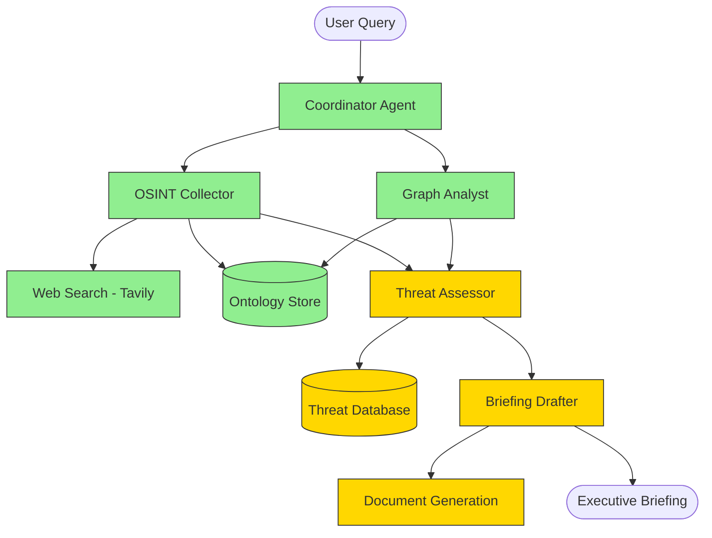

# Palantir Ontology Agents

> **Alex Karp**: *"The demand for AIP, in virtually every context, is extraordinary."*
>
> This multi-agent system shows what agentic workflows on the ontology look like in practice.

A working multi-agent system built with LangGraph that demonstrates how specialist agents coordinate over an ontology-structured data layer to produce actionable intelligence -- mirroring Palantir AIP's agentic workflow architecture.

**Demo scenario**: 4 agents analyze a Taiwan Strait supply chain disruption, traverse a 50-entity ontology graph, assess threats, and deliver an executive briefing in under 2 minutes.

https://github.com/hashwnath/palantir-ontology-agents/raw/main/docs/demo.mp4

## Architecture



**Green** = Live (working code) | **Yellow** = Scaffolded (mock data, clean integration points)

## Live vs Blueprint

| Component | Status | Notes |
|-----------|--------|-------|
| Coordinator Agent | **Live** | Routes queries, manages ontology state |
| OSINT Collector | **Live** | Web search via Tavily, entity extraction |
| Graph Analyst | **Live** | Ontology traversal, relationship analysis, exposure scoring |
| Ontology Store | **Live** | In-memory typed graph with 50+ entities, 100+ relationships |
| Web Search Tool | **Live** | Tavily API with demo mode fallback |
| Threat Assessor | Blueprint | Mock threat data, clean integration points for classified feeds |
| Briefing Drafter | Blueprint | LLM generation with template, integration points for Palantir doc system |
| Threat Database | Blueprint | Sample data, documented API for real threat feeds |
| Document Generation | Blueprint | Template output, integration points for Palantir document pipeline |
| Foundry API Connector | Blueprint | Documented interface, mock responses |

## Quick Start

```bash
# Clone
git clone https://github.com/hashwnath/palantir-ontology-agents.git
cd palantir-ontology-agents

# Install
pip install -r requirements.txt

# Set API keys (optional -- demo mode works without them)
export TAVILY_API_KEY=your_tavily_key        # for live OSINT web search
export ANTHROPIC_API_KEY=your_anthropic_key  # for LLM-powered features

# Run the Streamlit demo
streamlit run src/ui/app.py

# Run tests
pytest tests/ -v

# Run the orchestrator directly
python -c "
from src.orchestrator import Orchestrator
orch = Orchestrator()
result = orch.run('Track supply chain disruptions in Taiwan Strait, assess partner exposure, draft SECDEF briefing')
print(result['briefing']['briefing_text'])
"
```

## Demo Scenario: Taiwan Strait Supply Chain Disruption

The system analyzes a realistic geopolitical scenario:

- **50+ entities**: TSMC, ASML, Apple, NVIDIA, US Pacific Fleet, PLA Navy, shipping companies, ports, military assets, threat vectors
- **100+ relationships**: Supply chains, dependencies, military deployments, threat connections
- **4 specialist agents** execute in parallel and sequential phases:
  1. **OSINT Collector** searches for current intelligence (Tavily web search or demo data)
  2. **Graph Analyst** traverses the ontology to find dependency chains and exposure scores
  3. **Threat Assessor** evaluates risk with confidence scoring and historical precedents
  4. **Briefing Drafter** generates a structured executive briefing

## Ontology

The typed ontology layer supports:

- **Entity types**: Organization, Person, Location, Event, Asset, Threat
- **Relationship types**: OPERATES_IN, SUPPLIES, THREATENS, DEPENDS_ON, DEPLOYED_AT, MONITORS, and 13 more
- **Graph traversal**: N-hop queries, dependency chain discovery, exposure scoring
- **BFS shortest path**: Find connections between any two entities

## Project Structure

```
src/
  orchestrator.py          -- Coordinator agent, routes tasks, manages ontology state
  ontology/
    schema.py              -- Typed entity and relationship dataclasses
    store.py               -- In-memory graph store with traversal
    loader.py              -- 50+ entity Taiwan Strait scenario data
  agents/
    osint_agent.py         -- OSINT collection via web search (LIVE)
    graph_agent.py         -- Ontology graph analysis (LIVE)
    threat_agent.py        -- Threat assessment (SCAFFOLDED)
    briefing_agent.py      -- Briefing generation (SCAFFOLDED)
  graph/
    state.py               -- LangGraph AgentState schema
    nodes.py               -- Node functions wrapping agents
    workflow.py            -- StateGraph: coordinator -> [osint || graph] -> threat -> briefing
  tools/
    web_search.py          -- Tavily search with demo fallback
    ontology_tools.py      -- Query and traverse ontology
    threat_tools.py        -- Mock threat intelligence
    document_tools.py      -- Briefing template generation
  ui/
    app.py                 -- Streamlit demo interface
tests/                     -- Full test suite
config/                    -- Agent configs and system prompts
```

## Adjacent-Industry Precedents

This project draws structural inspiration from:

- **Anduril Lattice** -- AI agent orchestration for defense decision-making
- **Scale AI Donovan** -- Government intelligence analysis with multi-agent workflows
- **Databricks LakehouseIQ** -- Ontology-structured data analysis with AI agents

## Tech Stack

- **LangGraph** -- StateGraph workflow with parallel branching
- **LangChain + Claude** -- claude-sonnet-4-20250514 for agent reasoning
- **Tavily** -- Real-time web search for OSINT
- **Streamlit** -- Interactive demo UI
- **Python dataclasses** -- Typed ontology schema

## About

Built by **Hashwanth Sutharapu** -- contributor to [Microsoft Agent Framework](https://github.com/microsoft/agent-framework) (8K+ stars) and [awesome-copilot](https://github.com/nicepkg/awesome-copilot) (29K+ stars). SDE at MAQ Software (Microsoft Partner), Bellevue WA.

---

*This is a technical demonstration. No classified data is used. All scenario data is derived from public sources.*
